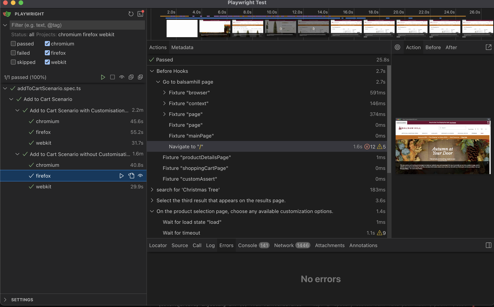
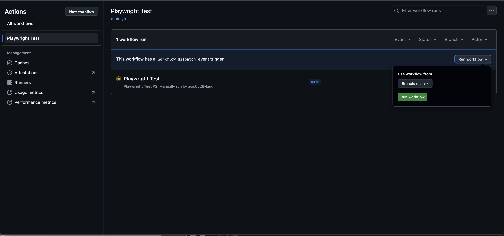

## 🚀 Quick Start

## Project Description
- sample project for simple automation framework

### Prerequisites

- **Node.js** (v18 or later)
- **npm** 
- **VsCode** 

### Installation

```bash
# Clone repository
git clone <repository-url>
cd testAuto

# Install dependencies 
npm install

# Install CI
npm ci

# Install Playwright with browser
npx playwright install-deps

```

### Running Tests

```bash

# Run all tests
npm run test


# Run with UI mode (interactive)
npx playwright test --ui



# Run in headed mode (see browser)
npx playwright test --headed ( this will open a browser, but make sure you already installed dependencies)

# Run in VSCode
just click the Testing Icon to Open the Test Explorer

#Run in Github Action
Select Playwright Test Workflow and run it using main Branch


```

### Browser Support

- **Chrome Desktop** (Primary)
- Firefox (Available)
- Safari/WebKit (Available)
